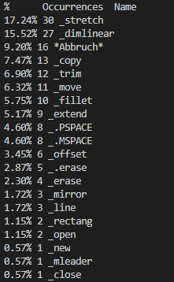

# AutodeskLogAnalysis

Small Tool to analyse used commands in Autodesk. Currently it shows usage percentage of all used commands. 



## Download

You can either download the python file analysis<span></span>.py and run that or use the newest executable from [here](https://github.com/Fenox/AutodeskLogAnalysis/releases)

## Usage

Run the .py or .exe with the following command:

```console
analysis.[py | exe] --logs [Folder with Logs]
```

For example:

```console
analysis.exe --logs SampleData
```
